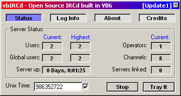



## vbIRCd \- The First Open Source IRCd submitted to PSC \[Updated2\]

### Description

Here's Update2 of vbIRCd which is v1.0.48 and I hope you enjoy this since it has a few bug fixes and another things. See Change.log file for details. -=- vbIRCd Support Forum at http://vbircd.ircd-net.org/forum
 
### More Info
 

             |
---                |---
**Submitted On**   |2001-04-09 16:37:54
**By**             |[TRON](https://github.com/Planet-Source-Code/PSCIndex/blob/master/ByAuthor/tron.md)
**Level**          |Advanced
**User Rating**    |4.5 (76 globes from 17 users)
**Compatibility**  |VB 4\.0 \(32\-bit\), VB 5\.0, VB 6\.0
**Category**       |[Internet/ HTML](https://github.com/Planet-Source-Code/PSCIndex/blob/master/ByCategory/internet-html__1-34.md)
**World**          |[Visual Basic](https://github.com/Planet-Source-Code/PSCIndex/blob/master/ByWorld/visual-basic.md)
**Archive File**   |[vbIRCd \- T18133492001\.zip](https://github.com/Planet-Source-Code/tron-vbircd-the-first-open-source-ircd-submitted-to-psc-updated2__1-22124/archive/master.zip)

